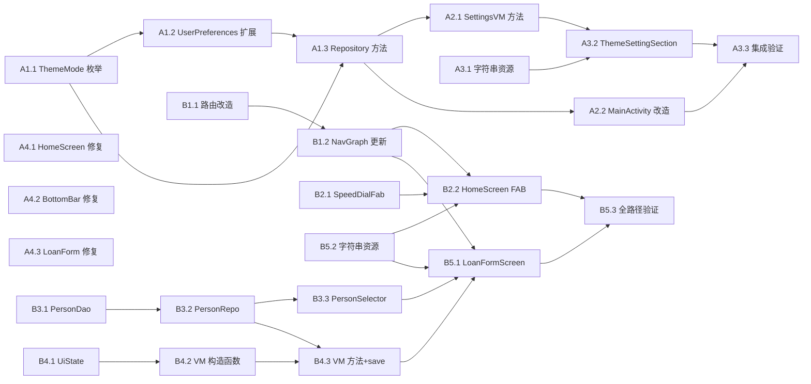

# 功能规划：日夜模式切换 + 简化记账流程

**规划时间**：2026-02-27
**预估工作量**：26 任务点
**设计文档**：[ui-design-theme-and-flow.md](./ui-design-theme-and-flow.md)

---

## 1. 功能概述

### 1.1 目标

**功能 A -- 日夜模式切换**：用户可在设置页面选择浅色/深色/跟随系统三种主题模式，偏好持久化保存，整个应用即时响应切换。

**功能 B -- 简化记账流程**：用户可从首页 FAB 直接进入借条表单，在表单中搜索/选择/创建联系人，将核心操作路径从 4 步缩减为 2 步。

### 1.2 范围

**包含**：
- ThemeMode 枚举与 DataStore 持久化
- 设置页面外观区块 (SegmentedButton)
- MainActivity 主题驱动
- 全部硬编码颜色替换为 MaterialTheme token
- HomeScreen FAB 改造为 Speed Dial
- LoanForm 路由 personId 改为可选
- PersonSelector 联系人搜索/选择/自动创建组件
- LoanFormViewModel 联系人相关逻辑
- PersonDao/PersonRepository 新增 searchByName 方法

**不包含**：
- 主题切换动画 (animateColorAsState，留作 Phase 2)
- 动态配色 (Dynamic Color) 开关
- 多语言支持扩展
- 联系人表单内嵌（仅自动创建名称，完整编辑走独立表单）

### 1.3 技术约束
- 使用 Material3 SegmentedButton（需 `@OptIn(ExperimentalMaterial3Api::class)`）
- DataStore Preferences 存储主题偏好（字符串键）
- Navigation Compose 路由参数兼容性（不破坏现有 Deep Link）
- 联系人搜索使用 Room 的 `LIKE` 查询 + 300ms debounce

---

## 2. WBS 任务分解

### 2.1 分解结构图

```mermaid
graph TD
    ROOT["功能需求"] --> A["功能 A: 日夜模式切换"]
    ROOT --> B["功能 B: 简化记账流程"]

    A --> A1["A1: 数据层"]
    A --> A2["A2: 主题驱动层"]
    A --> A3["A3: 设置页面 UI"]
    A --> A4["A4: 硬编码颜色修复"]

    A1 --> A1a["ThemeMode 枚举"]
    A1 --> A1b["UserPreferences 扩展"]
    A1 --> A1c["Repository 方法"]

    A2 --> A2a["MainActivity 改造"]
    A2 --> A2b["SettingsViewModel 扩展"]

    A3 --> A3a["ThemeSettingSection 组件"]
    A3 --> A3b["SettingsScreen 集成"]
    A3 --> A3c["字符串资源"]

    A4 --> A4a["HomeScreen 修复"]
    A4 --> A4b["AssetGuardBottomBar 修复"]
    A4 --> A4c["Color.kt 辅助色审计"]

    B --> B1["B1: 路由层改造"]
    B --> B2["B2: SpeedDialFab 组件"]
    B --> B3["B3: PersonSelector 组件"]
    B --> B4["B4: ViewModel 改造"]
    B --> B5["B5: 页面集成"]

    B1 --> B1a["Screen.LoanForm 路由"]
    B1 --> B1b["AppNavGraph 更新"]

    B2 --> B2a["SpeedDialFab 实现"]
    B2 --> B2b["HomeScreen FAB 替换"]

    B3 --> B3a["PersonDao 新增查询"]
    B3 --> B3b["PersonRepository 新增方法"]
    B3 --> B3c["PersonSelector 实现"]

    B4 --> B4a["LoanFormUiState 扩展"]
    B4 --> B4b["LoanFormViewModel 方法"]
    B4 --> B4c["save 方法改造"]

    B5 --> B5a["LoanFormScreen 集成"]
    B5 --> B5b["字符串资源"]
```



### 2.2 任务清单

---

#### 模块 A1：数据层 -- ThemeMode 定义与持久化（3 任务点）

##### 任务 A1.1：新建 ThemeMode 枚举（0.5 点）

**文件**: `app/src/main/java/com/zipper/compose/assetguard/data/model/ThemeMode.kt` **[新建]**

- [ ] 创建 `ThemeMode` 枚举，包含 `LIGHT`、`DARK`、`SYSTEM` 三个值
- **输入**：无
- **输出**：可在全项目引用的主题模式枚举
- **关键步骤**：
  1. 在 `data/model/` 包下新建 `ThemeMode.kt`
  2. 定义枚举 `ThemeMode { LIGHT, DARK, SYSTEM }`
  3. 默认值为 `SYSTEM`

##### 任务 A1.2：UserPreferences 增加 themeMode 字段（0.5 点）

**文件**: `app/src/main/java/com/zipper/compose/assetguard/data/preferences/UserPreferences.kt` **[修改]**

- [ ] 在 `UserPreferences` data class 中新增 `themeMode: ThemeMode = ThemeMode.SYSTEM` 字段
- **输入**：ThemeMode 枚举（A1.1）
- **输出**：扩展后的 UserPreferences
- **关键步骤**：
  1. 导入 `ThemeMode`
  2. 在构造函数中新增 `val themeMode: ThemeMode = ThemeMode.SYSTEM`
- **当前状态**：文件有 8 个字段（reminderHour, reminderMinute, reminderAdvanceDays, onlyOverdue, silentStartHour, silentEndHour, notificationPermissionAsked, appLockEnabled），在末尾添加新字段

##### 任务 A1.3：UserPreferencesRepository 增加主题偏好读写（2 点）

**文件**: `app/src/main/java/com/zipper/compose/assetguard/data/preferences/UserPreferencesRepository.kt` **[修改]**

- [ ] 在 `Keys` object 中新增 `THEME_MODE = stringPreferencesKey("theme_mode")`
- [ ] 在 `userPreferences` Flow 的 map 中读取 `themeMode`，将字符串转为枚举（fallback 到 `SYSTEM`）
- [ ] 新增 `suspend fun saveThemeMode(mode: ThemeMode)` 方法
- [ ] 新增 `fun observeThemeMode(): Flow<ThemeMode>` 便捷方法（供 MainActivity 直接观察）
- **输入**：ThemeMode 枚举（A1.1）
- **输出**：可读写主题偏好的 Repository
- **关键步骤**：
  1. 在 `Keys` 中添加 `val THEME_MODE = stringPreferencesKey("theme_mode")`
  2. 修改 `userPreferences` Flow 的 map lambda，新增 `themeMode = ThemeMode.valueOf(prefs[Keys.THEME_MODE] ?: ThemeMode.SYSTEM.name)`（需 try-catch 防止枚举解析失败）
  3. 新增 `saveThemeMode` 方法：`context.dataStore.edit { it[Keys.THEME_MODE] = mode.name }`
  4. 新增 `observeThemeMode` 方法：`context.dataStore.data.map { prefs -> ... }`
  5. 需新增 import：`stringPreferencesKey`
- **当前状态**：已有 `intPreferencesKey` 和 `booleanPreferencesKey` 的 import，需新增 `stringPreferencesKey`

---

#### 模块 A2：主题驱动层（2 任务点）

##### 任务 A2.1：SettingsViewModel 增加 updateThemeMode 方法（1 点）

**文件**: `app/src/main/java/com/zipper/compose/assetguard/ui/settings/SettingsViewModel.kt` **[修改]**

- [ ] 新增 `fun updateThemeMode(mode: ThemeMode)` 方法
- **输入**：UserPreferencesRepository.saveThemeMode（A1.3）
- **输出**：SettingsScreen 可调用的主题更新入口
- **关键步骤**：
  1. 导入 `ThemeMode`
  2. 新增方法：
     ```kotlin
     fun updateThemeMode(mode: ThemeMode) {
         viewModelScope.launch {
             userPreferencesRepository.saveThemeMode(mode)
         }
     }
     ```
  3. 由于 `userPreferences` StateFlow 已观察整个 `UserPreferences`，保存后 UI 会自动收到新的 `themeMode` 值

##### 任务 A2.2：MainActivity 读取主题偏好驱动 AssetGuardTheme（1 点）

**文件**: `app/src/main/java/com/zipper/compose/assetguard/MainActivity.kt` **[修改]**

- [ ] 在 `setContent` 中读取 `themeMode` Flow 并转换为 `darkTheme` 参数
- [ ] 将 `darkTheme` 传入 `AssetGuardTheme`
- **输入**：UserPreferencesRepository.observeThemeMode（A1.3）
- **输出**：主题随偏好动态切换
- **关键步骤**：
  1. 新增 import：`collectAsStateWithLifecycle`、`isSystemInDarkTheme`、`ThemeMode`
  2. 在 `setContent { }` 块内、`AssetGuardTheme` 外部添加：
     ```kotlin
     val themeMode by container.userPreferencesRepository
         .observeThemeMode()
         .collectAsStateWithLifecycle(initialValue = ThemeMode.SYSTEM)
     val darkTheme = when (themeMode) {
         ThemeMode.LIGHT -> false
         ThemeMode.DARK -> true
         ThemeMode.SYSTEM -> isSystemInDarkTheme()
     }
     ```
  3. 修改 `AssetGuardTheme { ... }` 为 `AssetGuardTheme(darkTheme = darkTheme) { ... }`
- **当前状态**：当前 `AssetGuardTheme` 未传参数，`darkTheme` 默认为 `true`（硬编码暗色）

---

#### 模块 A3：设置页面 UI -- 外观区块（3 任务点）

##### 任务 A3.1：新增字符串资源（0.5 点）

**文件**: `app/src/main/res/values/strings.xml` **[修改]**

- [ ] 在 `<!-- 设置 -->` 区域新增以下字符串：
  ```xml
  <!-- 设置 - 外观 -->
  <string name="settings_section_appearance">外观</string>
  <string name="settings_theme">主题</string>
  <string name="settings_theme_desc">根据您的偏好调整应用外观</string>
  <string name="theme_light">浅色</string>
  <string name="theme_dark">深色</string>
  <string name="theme_system">跟随系统</string>
  ```
- **关键步骤**：在 `<string name="settings_title">` 和 `<string name="settings_section_notification">` 之间插入

##### 任务 A3.2：实现 ThemeSettingSection 组件（1.5 点）

**实现方式**：内联在 SettingsScreen 中（无需新建独立文件，组件足够简单）

**文件**: `app/src/main/java/com/zipper/compose/assetguard/ui/settings/SettingsScreen.kt` **[修改]**

- [ ] 在 SettingsScreen 的 Column 内容最顶部（Spacer 之后、通知设置 Card 之前）插入外观设置区块
- **输入**：UserPreferences.themeMode（通过 SettingsViewModel）
- **输出**：包含 SingleChoiceSegmentedButtonRow 的外观设置卡片
- **关键步骤**：
  1. 新增 import：`SingleChoiceSegmentedButtonRow`、`SegmentedButton`、`SegmentedButtonDefaults`、`Icons.Outlined.LightMode`、`Icons.Outlined.DarkMode`、`Icons.Outlined.SettingsSuggest`、`Icons.Outlined.Palette`、`ThemeMode`
  2. 在 Column 中 `Spacer(Modifier.height(MaterialTheme.spacing.sm))` 之后插入：
     - "外观" 区块标题 Text（primary 色，titleSmall 样式）
     - Card 容器，内含 ListItem（图标 + 标题 + 说明）+ SingleChoiceSegmentedButtonRow
  3. SegmentedButton 三个选项：浅色（LightMode 图标）、深色（DarkMode 图标）、跟随系统（SettingsSuggest 图标）
  4. 选中状态绑定 `prefs.themeMode`，点击回调 `viewModel.updateThemeMode(mode)`
  5. 参考设计文档 A.4.4 的实现结构

##### 任务 A3.3：SettingsScreen 集成验证（1 点）

**文件**: `app/src/main/java/com/zipper/compose/assetguard/ui/settings/SettingsScreen.kt` **[修改]**

- [ ] 确认外观区块位于最顶部，通知设置区块下移
- [ ] 确认 SegmentedButton 选中态与 `prefs.themeMode` 同步
- [ ] 确认切换后整个应用主题即时响应（通过 A2.2 的 MainActivity 驱动链）
- **验收标准**：
  - 打开设置页面，外观区块可见且位于顶部
  - 点击三个选项分别切换主题
  - 杀进程重启后保持上次选择

---

#### 模块 A4：硬编码颜色修复（3 任务点）

##### 任务 A4.1：修复 HomeScreen 硬编码颜色（2 点）

**文件**: `app/src/main/java/com/zipper/compose/assetguard/ui/home/HomeScreen.kt` **[修改]**

- [ ] 按以下映射表逐一替换：

| 行号 | 当前硬编码 | 替换为 |
|------|-----------|--------|
| L130 | `containerColor = Color(0xFF0C0C0C)` | `MaterialTheme.colorScheme.background` |
| L146 | `containerColor = Color(0xFF0C0C0C)` | `MaterialTheme.colorScheme.background` |
| L147 | `titleContentColor = Color.White` | `MaterialTheme.colorScheme.onBackground` |
| L148 | `actionIconContentColor = Color.White` | `MaterialTheme.colorScheme.onBackground` |
| L173 | `.background(Color(0xFF0C0C0C))` | `.background(MaterialTheme.colorScheme.background)` |
| L286 (OverviewGradientCard, SummaryItem) | `color = TextMuted` | `MaterialTheme.extendedColorScheme.textMuted` 或 `MaterialTheme.colorScheme.onSurfaceVariant` |
| L322 | `color = Color.White` | `MaterialTheme.colorScheme.onSurface` |
| L343 | `backgroundColor = Color(0xFF1A1A1D)` | `MaterialTheme.colorScheme.surfaceVariant` |
| L350 | `backgroundColor = Color(0xFF1A1A1D)` | `MaterialTheme.colorScheme.surfaceVariant` |
| L357 | `backgroundColor = Color(0xFF1A1A1D)` | `MaterialTheme.colorScheme.surfaceVariant` |
| L342, L349 | `... else Color.White` | `MaterialTheme.colorScheme.onSurface` |
| L356 | `valueColor = Color.White` | `MaterialTheme.colorScheme.onSurface` |
| L379 | `containerColor = Color(0xFF141417)` | `MaterialTheme.colorScheme.surfaceContainer` |
| L401 | `color = Color.White` | `MaterialTheme.colorScheme.onSurface` |
| L428 | `containerColor = Color(0xFF141417)` | `MaterialTheme.colorScheme.surfaceVariant` |
| L457 | `color = Color.White` | `MaterialTheme.colorScheme.onSurface` |
| L463 | `color = TextMuted` | `MaterialTheme.colorScheme.onSurfaceVariant` |
| L471,484 | `color = TextMuted` | `MaterialTheme.colorScheme.onSurfaceVariant` |
| L494 | `tint = TextMuted` | `MaterialTheme.colorScheme.onSurfaceVariant` |

- **关键步骤**：
  1. 移除 `import com.zipper.compose.assetguard.ui.theme.TextMuted` 的直接使用，改用 `MaterialTheme.extendedColorScheme.textMuted` 或更通用的 `MaterialTheme.colorScheme.onSurfaceVariant`
  2. 移除 `import com.zipper.compose.assetguard.ui.theme.DividerDark`（如有）
  3. 移除 `import androidx.compose.ui.graphics.Color` 中不再需要的硬编码 Color 构造
  4. 注意 KpiIndicator 的 `valueColor` 和 `backgroundColor` 参数类型是否为 Color，直接替换
- **注意**：`StatusOverdue`、`StatusPartial` 等状态色保持使用顶层常量（这些是语义色，浅色/深色模式下值相同，或可后续通过 ExtendedColorScheme 提供）

##### 任务 A4.2：修复 AssetGuardBottomBar 硬编码颜色（0.5 点）

**文件**: `app/src/main/java/com/zipper/compose/assetguard/ui/components/AssetGuardBottomBar.kt` **[修改]**

- [ ] 替换以下硬编码颜色引用：

| 行号 | 当前引用 | 替换为 |
|------|---------|--------|
| L26 | `val borderColor = DividerDark` | `val borderColor = MaterialTheme.colorScheme.outlineVariant` |
| L74 (BottomTabItem) | `unselectedIconColor = TextMuted` | `MaterialTheme.colorScheme.onSurfaceVariant` |
| L75 | `unselectedTextColor = TextMuted` | `MaterialTheme.colorScheme.onSurfaceVariant` |

- **关键步骤**：
  1. 移除 `import com.zipper.compose.assetguard.ui.theme.DividerDark`
  2. 移除 `import com.zipper.compose.assetguard.ui.theme.TextMuted`
  3. 注意 `borderColor` 变量在 `drawBehind` lambda 中使用，需要确保在 Composable 作用域内获取 MaterialTheme token

##### 任务 A4.3：审计并修复 LoanFormScreen 硬编码颜色（0.5 点）

**文件**: `app/src/main/java/com/zipper/compose/assetguard/ui/loan/LoanFormScreen.kt` **[修改]**

- [ ] 替换输入框颜色配置中的硬编码：

| 行号 | 当前引用 | 替换为 |
|------|---------|--------|
| L83 | `focusedContainerColor = CardInputBackground` | `MaterialTheme.colorScheme.surfaceContainerHigh` |
| L84 | `unfocusedContainerColor = CardInputBackground` | `MaterialTheme.colorScheme.surfaceContainerHigh` |
| L86 | `unfocusedBorderColor = CardInputBorder` | `MaterialTheme.colorScheme.outline` |

- **关键步骤**：
  1. 移除 `import com.zipper.compose.assetguard.ui.theme.CardInputBackground`
  2. 移除 `import com.zipper.compose.assetguard.ui.theme.CardInputBorder`
  3. 确认浅色模式下输入框背景和边框视觉效果可接受

---

#### 模块 B1：路由层改造（2 任务点）

##### 任务 B1.1：Screen.LoanForm 路由 personId 改为可选参数（1 点）

**文件**: `app/src/main/java/com/zipper/compose/assetguard/ui/navigation/Screen.kt` **[修改]**

- [ ] 将 `LoanForm` 的路由从 `loan_form/{personId}?loanId={loanId}` 改为 `loan_form?personId={personId}&loanId={loanId}`
- [ ] 修改 `createRoute` 方法签名：`personId: Long?` 改为可选
- **输入**：无
- **输出**：personId 可选的 LoanForm 路由
- **关键步骤**：
  1. 修改 route 字符串：`"loan_form?personId={personId}&loanId={loanId}"`
  2. 修改 createRoute：
     ```kotlin
     data object LoanForm : Screen("loan_form?personId={personId}&loanId={loanId}") {
         fun createRoute(personId: Long? = null, loanId: Long? = null): String {
             val params = mutableListOf<String>()
             personId?.let { params.add("personId=$it") }
             loanId?.let { params.add("loanId=$it") }
             return if (params.isEmpty()) "loan_form"
             else "loan_form?${params.joinToString("&")}"
         }
     }
     ```
- **风险**：现有调用 `Screen.LoanForm.createRoute(personId)` 和 `Screen.LoanForm.createRoute(personId, loanId)` 的代码将产生编译错误，需要同步更新
- **受影响调用点**：
  - `AppNavGraph.kt` L84：`Screen.LoanForm.createRoute(personId)` -- PersonDetail 的 onAddLoan
  - `AppNavGraph.kt` L114：`Screen.LoanForm.createRoute(personId, loanId)` -- LoanDetail 的 onEditLoan
  - 这些调用保持传 personId（非 null），编译兼容

##### 任务 B1.2：AppNavGraph 更新 LoanForm 路由注册（1 点）

**文件**: `app/src/main/java/com/zipper/compose/assetguard/ui/navigation/AppNavGraph.kt` **[修改]**

- [ ] 更新 LoanForm 的 composable 路由注册，personId 改为可选参数（带默认值 -1L）
- [ ] 更新 HomeScreen 路由，新增 `onAddLoan` 回调
- **输入**：Screen.LoanForm 新路由（B1.1）
- **输出**：完整的路由注册与导航调用
- **关键步骤**：
  1. 修改 LoanForm composable 注册（约 L125-140）：
     ```kotlin
     composable(
         route = Screen.LoanForm.route,
         arguments = listOf(
             navArgument("personId") { type = NavType.LongType; defaultValue = -1L },
             navArgument("loanId") { type = NavType.LongType; defaultValue = -1L }
         )
     ) { backStackEntry ->
         val personId = backStackEntry.arguments?.getLong("personId")?.takeIf { it != -1L }
         val loanId = backStackEntry.arguments?.getLong("loanId")?.takeIf { it != -1L }
         LoanFormScreen(
             personId = personId,  // 现在为 Long?
             loanId = loanId,
             container = container,
             onBack = { navController.popBackStack() }
         )
     }
     ```
  2. 修改 HomeScreen composable（约 L34-44），新增 `onAddLoan`：
     ```kotlin
     HomeScreen(
         container = container,
         onPersonClick = { personId -> ... },
         onAddPerson = { ... },
         onAddLoan = {
             navController.navigate(Screen.LoanForm.createRoute())
         },
     )
     ```

---

#### 模块 B2：SpeedDialFab 组件（3 任务点）

##### 任务 B2.1：实现 SpeedDialFab 组件（2 点）

**文件**: `app/src/main/java/com/zipper/compose/assetguard/ui/components/SpeedDialFab.kt` **[新建]**

- [ ] 创建 `SpeedDialItem` data class 和 `SpeedDialFab` Composable
- **输入**：设计文档 B.3.3 的规格定义
- **输出**：可复用的 Speed Dial FAB 组件
- **关键步骤**：
  1. 定义 `SpeedDialItem(icon, label, onClick)`
  2. 实现 `SpeedDialFab` Composable：
     - 内部状态 `expanded: Boolean`
     - 主 FAB：Add 图标，点击切换展开/收起
     - 展开时显示遮罩层（半透明黑色 alpha=0.32f，点击收起）
     - 展开时子 FAB 列表从下往上弹出（SmallFloatingActionButton + 标签 Surface）
     - 动画：主 FAB 图标旋转 45 度，子 FAB 使用 AnimatedVisibility
  3. 参考设计文档 B.3.3 的完整实现结构
- **注意**：遮罩层需要占据整个屏幕空间。由于 SpeedDialFab 在 Scaffold 的 floatingActionButton 插槽中，遮罩层需要使用 `Box(Modifier.fillMaxSize())` 在外层容器中绘制。考虑使用 `Popup` 或 `Box` with `offset` 方案

##### 任务 B2.2：HomeScreen FAB 替换为 SpeedDialFab（1 点）

**文件**: `app/src/main/java/com/zipper/compose/assetguard/ui/home/HomeScreen.kt` **[修改]**

- [ ] 修改 HomeScreen 函数签名，新增 `onAddLoan: () -> Unit` 参数
- [ ] 替换 floatingActionButton 中的 FloatingActionButton 为 SpeedDialFab
- **输入**：SpeedDialFab 组件（B2.1）
- **输出**：首页 FAB 支持展开两个选项
- **关键步骤**：
  1. 修改函数签名（约 L80-84）：
     ```kotlin
     fun HomeScreen(
         container: AppContainer,
         onPersonClick: (Long) -> Unit,
         onAddPerson: () -> Unit,
         onAddLoan: () -> Unit,    // 新增
         viewModel: HomeViewModel = ...
     )
     ```
  2. 替换 floatingActionButton 内容（约 L161-167）：
     ```kotlin
     floatingActionButton = {
         if (!uiState.isSelectionMode) {
             SpeedDialFab(
                 items = listOf(
                     SpeedDialItem(
                         icon = Icons.Default.NoteAdd,
                         label = stringResource(R.string.home_add_loan),
                         onClick = onAddLoan
                     ),
                     SpeedDialItem(
                         icon = Icons.Default.PersonAdd,
                         label = stringResource(R.string.home_add_person),
                         onClick = onAddPerson
                     ),
                 )
             )
         }
     }
     ```
  3. 新增 import：`SpeedDialFab`、`SpeedDialItem`、`Icons.Default.NoteAdd`
  4. 新增字符串资源 `home_add_loan`

---

#### 模块 B3：PersonSelector 组件（4 任务点）

##### 任务 B3.1：PersonDao 新增 searchByName 查询（0.5 点）

**文件**: `app/src/main/java/com/zipper/compose/assetguard/data/local/dao/PersonDao.kt` **[修改]**

- [ ] 新增 suspend 函数 `searchByName`，返回 `List<PersonEntity>`
- **输入**：无
- **输出**：按名称/电话模糊搜索的 DAO 方法
- **关键步骤**：
  1. 新增查询方法：
     ```kotlin
     @Query("SELECT * FROM persons WHERE name LIKE '%' || :query || '%' OR phone LIKE '%' || :query || '%' ORDER BY updatedAt DESC LIMIT 10")
     suspend fun searchByName(query: String): List<PersonEntity>
     ```
  2. 注意与现有 `searchWithSummary` 的区别：这里返回 `List<PersonEntity>` 而非 Flow，用于即时搜索

##### 任务 B3.2：PersonRepository 新增 searchByName 方法（0.5 点）

**文件**: `app/src/main/java/com/zipper/compose/assetguard/data/repository/PersonRepository.kt` **[修改]**

- [ ] 新增 `suspend fun searchByName(query: String): List<PersonEntity>`
- **输入**：PersonDao.searchByName（B3.1）
- **输出**：Repository 层的搜索方法
- **关键步骤**：
  1. 新增方法：`suspend fun searchByName(query: String): List<PersonEntity> = personDao.searchByName(query)`

##### 任务 B3.3：实现 PersonSelector 组件（3 点）

**文件**: `app/src/main/java/com/zipper/compose/assetguard/ui/components/PersonSelector.kt` **[新建]**

- [ ] 实现完整的联系人搜索/选择/创建组件
- **输入**：设计文档 B.4.4 的完整规格
- **输出**：可在 LoanFormScreen 中使用的 PersonSelector
- **关键步骤**：
  1. 定义 `PersonSelector` Composable 函数签名（参照设计文档）
  2. 实现三种显示模式：
     - **锁定模式**（`isLocked = true`）：只读 Card 显示联系人信息 + 锁定图标
     - **已选择模式**（`selectedPerson != null || newPersonName.isNotBlank()`）：OutlinedCard 显示选中信息 + 清除按钮
     - **搜索模式**（默认）：`ExposedDropdownMenuBox` + `OutlinedTextField` + 下拉搜索结果
  3. 下拉列表内容：
     - 匹配的已有联系人（AvatarView + 名称 + 电话）
     - 分割线
     - "新建联系人 '{query}'" 选项（PersonAdd 图标 + primary 色文字）
  4. 实现 `SelectedPersonChip` 和 `LockedPersonChip` 私有 Composable
  5. 导入 AvatarView 组件（已存在于项目中）
  6. 参考设计文档 B.4.4 的完整实现结构

---

#### 模块 B4：LoanFormViewModel 改造（3 任务点）

##### 任务 B4.1：LoanFormUiState 扩展联系人字段（0.5 点）

**文件**: `app/src/main/java/com/zipper/compose/assetguard/ui/loan/LoanFormViewModel.kt` **[修改]**

- [ ] 在 `LoanFormUiState` data class 中新增联系人相关字段
- **输入**：PersonEntity 类型（已存在）
- **输出**：支持联系人状态的 UiState
- **关键步骤**：
  1. 导入 `PersonEntity`
  2. 新增字段：
     ```kotlin
     val isPersonLocked: Boolean = false,
     val selectedPerson: PersonEntity? = null,
     val newPersonName: String = "",
     val personQuery: String = "",
     val personSuggestions: List<PersonEntity> = emptyList(),
     val personError: Int? = null,
     ```

##### 任务 B4.2：LoanFormViewModel 构造函数与初始化改造（1 点）

**文件**: `app/src/main/java/com/zipper/compose/assetguard/ui/loan/LoanFormViewModel.kt` **[修改]**

- [ ] 构造函数 `personId` 类型改为 `Long?`
- [ ] 新增 `personRepository: PersonRepository` 参数
- [ ] init 块中根据 personId 是否为 null 决定是否锁定联系人
- [ ] 更新 `factory` 方法签名
- **输入**：PersonRepository（已存在于 AppContainer）
- **输出**：支持 personId 可选的 ViewModel
- **关键步骤**：
  1. 修改构造函数签名：
     ```kotlin
     class LoanFormViewModel(
         private val loanRepository: LoanRepository,
         private val paymentMethodRepository: PaymentMethodRepository,
         private val personRepository: PersonRepository,  // 新增
         private val personId: Long?,                     // 改为 nullable
         private val loanId: Long?
     )
     ```
  2. init 块新增联系人加载逻辑：
     ```kotlin
     if (personId != null) {
         viewModelScope.launch {
             personRepository.getById(personId)?.let { person ->
                 _uiState.value = _uiState.value.copy(
                     selectedPerson = person,
                     isPersonLocked = true
                 )
             }
         }
     }
     ```
  3. 新增 `private var searchJob: Job? = null` 成员变量
  4. 修改 factory：
     ```kotlin
     fun factory(container: AppContainer, personId: Long?, loanId: Long?) =
         object : ViewModelProvider.Factory {
             override fun <T : ViewModel> create(modelClass: Class<T>): T {
                 return LoanFormViewModel(
                     container.loanRepository,
                     container.paymentMethodRepository,
                     container.personRepository,  // 新增
                     personId,
                     loanId
                 ) as T
             }
         }
     ```

##### 任务 B4.3：LoanFormViewModel 新增联系人搜索/选择方法与 save 改造（1.5 点）

**文件**: `app/src/main/java/com/zipper/compose/assetguard/ui/loan/LoanFormViewModel.kt` **[修改]**

- [ ] 新增 `onPersonQueryChanged`、`onPersonSelected`、`onNewPersonSelected`、`clearPersonSelection` 方法
- [ ] 改造 `save()` 方法支持自动创建联系人
- **输入**：PersonRepository.searchByName（B3.2）
- **输出**：完整的联系人搜索/选择/创建逻辑
- **关键步骤**：
  1. 新增方法（参照设计文档 B.5.2）：
     - `onPersonQueryChanged(query: String)`：更新 personQuery、取消前次搜索 Job、delay 300ms 后调用 `personRepository.searchByName(query)` 更新 suggestions
     - `onPersonSelected(person: PersonEntity)`：设置 selectedPerson、清空 query/suggestions
     - `onNewPersonSelected(name: String)`：设置 newPersonName、清空 selectedPerson/query/suggestions
     - `clearPersonSelection()`：全部清空
  2. 改造 `save()` 方法：
     - 在金额验证之前新增联系人验证：
       - 若 `isPersonLocked`，使用 `selectedPerson?.id`
       - 若 `selectedPerson != null`，使用 `selectedPerson.id`
       - 若 `newPersonName.isNotBlank()`，标记需要先创建
       - 否则设置 `personError = R.string.error_select_person` 并 return
     - 在 viewModelScope.launch 中，若需要创建联系人：
       ```kotlin
       val finalPersonId = resolvedPersonId ?: personRepository.insert(
           PersonEntity(name = state.newPersonName)
       )
       ```
     - 使用 `finalPersonId` 替换原来的 `personId` 成员变量
  3. 新增字符串资源 `error_select_person`

---

#### 模块 B5：LoanFormScreen 页面集成（3 任务点）

##### 任务 B5.1：LoanFormScreen 函数签名与 PersonSelector 集成（2 点）

**文件**: `app/src/main/java/com/zipper/compose/assetguard/ui/loan/LoanFormScreen.kt` **[修改]**

- [ ] 修改 `personId` 参数类型为 `Long?`
- [ ] 在表单卡片顶部添加 PersonSelector 组件
- **输入**：PersonSelector 组件（B3.3）、LoanFormViewModel 改造（B4.2）
- **输出**：支持联系人选择的借条表单页面
- **关键步骤**：
  1. 修改函数签名：`personId: Long?`（从 `Long` 改为 `Long?`）
  2. 修改 viewModel factory 调用适配新签名
  3. 在 Card 内 Column 的最顶部（金额输入框之前）插入 PersonSelector：
     ```kotlin
     PersonSelector(
         selectedPerson = uiState.selectedPerson,
         newPersonName = uiState.newPersonName,
         query = uiState.personQuery,
         suggestions = uiState.personSuggestions,
         isLocked = uiState.isPersonLocked,
         error = uiState.personError,
         onQueryChanged = viewModel::onPersonQueryChanged,
         onPersonSelected = viewModel::onPersonSelected,
         onNewPersonSelected = viewModel::onNewPersonSelected,
         onClear = viewModel::clearPersonSelection,
         modifier = Modifier.fillMaxWidth()
     )
     Spacer(Modifier.height(MaterialTheme.spacing.md))
     ```
  4. 新增 import：`PersonSelector`

##### 任务 B5.2：新增字符串资源 -- 功能 B（0.5 点）

**文件**: `app/src/main/res/values/strings.xml` **[修改]**

- [ ] 新增以下字符串：
  ```xml
  <!-- 首页 FAB -->
  <string name="home_add_loan">新建借条</string>

  <!-- 借条表单 - 联系人选择 -->
  <string name="loan_form_label_person">联系人 *</string>
  <string name="loan_form_person_hint">搜索联系人或输入新名称...</string>
  <string name="loan_form_create_person">新建联系人「%s」</string>
  <string name="loan_form_new_person_tag">将自动创建</string>
  <string name="error_select_person">请选择或输入联系人</string>
  ```

##### 任务 B5.3：全路径验证（0.5 点）

- [ ] 验证路径 A：首页 FAB -> "新建借条" -> LoanForm (personId=null) -> 搜索选择联系人 -> 填写保存
- [ ] 验证路径 B：首页 -> 联系人详情 -> FAB -> LoanForm (personId=已知, 锁定) -> 填写保存
- [ ] 验证路径 C：首页 FAB -> "新建借条" -> 输入新联系人名 -> 选择"新建" -> 保存（自动创建联系人）
- [ ] 验证编辑模式：借条详情 -> 编辑 -> LoanForm (personId 已知, loanId 已知)
- **验收标准**：四条路径均正常工作，数据正确持久化

---

## 3. 依赖关系

### 3.1 依赖图



### 3.2 依赖说明

| 任务 | 依赖于 | 原因 |
|------|--------|------|
| A1.2 | A1.1 | UserPreferences 需引用 ThemeMode 类型 |
| A1.3 | A1.1, A1.2 | Repository 需要读写 ThemeMode，关联 UserPreferences |
| A2.1 | A1.3 | SettingsVM 调用 Repository 的 saveThemeMode |
| A2.2 | A1.3 | MainActivity 调用 Repository 的 observeThemeMode |
| A3.2 | A2.1, A3.1 | UI 需要 ViewModel 方法和字符串资源 |
| A3.3 | A2.2, A3.2 | 验证需要完整链路 |
| B1.2 | B1.1 | NavGraph 依赖 Screen 路由定义 |
| B2.2 | B2.1, B1.2 | HomeScreen FAB 替换需要组件和导航回调 |
| B3.2 | B3.1 | Repository 依赖 DAO |
| B3.3 | B3.2 | PersonSelector 的搜索结果由外部驱动，但需确认数据类型 |
| B4.2 | B4.1, B3.2 | ViewModel 改造依赖 UiState 和 PersonRepository |
| B4.3 | B4.2 | 新方法基于改造后的构造函数 |
| B5.1 | B3.3, B4.3, B1.2 | Screen 集成依赖组件、ViewModel 和路由 |
| B5.3 | B5.1, B2.2 | 全路径验证依赖所有改动完成 |

### 3.3 并行任务组

以下任务组之间无依赖，可以并行开发：

- **组 1**（功能 A 数据层）：A1.1 -> A1.2 -> A1.3
- **组 2**（功能 A 颜色修复）：A4.1 // A4.2 // A4.3（三个文件互不依赖）
- **组 3**（功能 B 路由）：B1.1 -> B1.2
- **组 4**（功能 B 组件）：B2.1 // B3.1 -> B3.2 -> B3.3（SpeedDialFab 与 PersonSelector 可并行）
- **组 5**（功能 B ViewModel）：B4.1 -> B4.2 -> B4.3

跨组并行关系：
- 组 1 和 组 2 完全并行
- 组 3、组 4、组 5 可以并行启动
- 功能 A 和 功能 B 几乎完全独立，可并行开发

---

## 4. 实施顺序建议

按优先级和依赖关系排列，推荐以下实施顺序：

### Phase 1：基础设施（无 UI 变更，低风险）

| 顺序 | 任务编号 | 任务描述 | 任务点 |
|------|----------|----------|--------|
| 1 | A1.1 | 新建 ThemeMode 枚举 | 0.5 |
| 2 | A1.2 | UserPreferences 增加 themeMode | 0.5 |
| 3 | A1.3 | UserPreferencesRepository 增加读写方法 | 2 |
| 4 | A4.1 | HomeScreen 硬编码颜色修复 | 2 |
| 5 | A4.2 | AssetGuardBottomBar 硬编码颜色修复 | 0.5 |
| 6 | A4.3 | LoanFormScreen 硬编码颜色修复 | 0.5 |

### Phase 2：主题驱动 + 设置 UI

| 顺序 | 任务编号 | 任务描述 | 任务点 |
|------|----------|----------|--------|
| 7 | A2.1 | SettingsViewModel 增加 updateThemeMode | 1 |
| 8 | A3.1 | 新增外观相关字符串资源 | 0.5 |
| 9 | A3.2 | 实现 ThemeSettingSection（SegmentedButton） | 1.5 |
| 10 | A2.2 | MainActivity 读取主题偏好驱动 | 1 |
| 11 | A3.3 | 设置页面集成验证 | 1 |

### Phase 3：简化记账 -- 基础组件

| 顺序 | 任务编号 | 任务描述 | 任务点 |
|------|----------|----------|--------|
| 12 | B1.1 | Screen.LoanForm 路由改造 | 1 |
| 13 | B2.1 | SpeedDialFab 组件实现 | 2 |
| 14 | B3.1 | PersonDao 新增 searchByName | 0.5 |
| 15 | B3.2 | PersonRepository 新增 searchByName | 0.5 |
| 16 | B3.3 | PersonSelector 组件实现 | 3 |
| 17 | B5.2 | 新增功能 B 字符串资源 | 0.5 |

### Phase 4：简化记账 -- 集成

| 顺序 | 任务编号 | 任务描述 | 任务点 |
|------|----------|----------|--------|
| 18 | B4.1 | LoanFormUiState 扩展 | 0.5 |
| 19 | B4.2 | LoanFormViewModel 构造函数改造 | 1 |
| 20 | B4.3 | ViewModel 联系人方法 + save 改造 | 1.5 |
| 21 | B1.2 | AppNavGraph 更新路由注册 | 1 |
| 22 | B2.2 | HomeScreen FAB 替换 | 1 |
| 23 | B5.1 | LoanFormScreen 集成 PersonSelector | 2 |
| 24 | B5.3 | 全路径验证 | 0.5 |

---

## 5. 新建文件清单

| 文件路径 | 用途 |
|----------|------|
| `app/src/main/java/com/zipper/compose/assetguard/data/model/ThemeMode.kt` | ThemeMode 枚举定义 |
| `app/src/main/java/com/zipper/compose/assetguard/ui/components/SpeedDialFab.kt` | Speed Dial FAB 组件 |
| `app/src/main/java/com/zipper/compose/assetguard/ui/components/PersonSelector.kt` | 联系人搜索/选择/创建组件 |

## 6. 修改文件清单

| 文件路径 | 功能 | 改动范围 |
|----------|------|----------|
| `app/src/main/java/com/.../data/preferences/UserPreferences.kt` | A | 新增 1 个字段 |
| `app/src/main/java/com/.../data/preferences/UserPreferencesRepository.kt` | A | 新增 1 个 Key + 2 个方法，修改 1 个 Flow |
| `app/src/main/java/com/.../ui/settings/SettingsViewModel.kt` | A | 新增 1 个方法 |
| `app/src/main/java/com/.../ui/settings/SettingsScreen.kt` | A | 新增外观设置区块（约 60 行） |
| `app/src/main/java/com/.../MainActivity.kt` | A | 新增约 10 行主题读取逻辑 |
| `app/src/main/java/com/.../ui/home/HomeScreen.kt` | A+B | 替换约 15 处硬编码颜色 + FAB 替换 |
| `app/src/main/java/com/.../ui/components/AssetGuardBottomBar.kt` | A | 替换 3 处颜色引用 |
| `app/src/main/java/com/.../ui/loan/LoanFormScreen.kt` | A+B | 替换 3 处颜色 + 新增 PersonSelector 集成 |
| `app/src/main/java/com/.../ui/loan/LoanFormViewModel.kt` | B | 改造构造函数 + 扩展 UiState + 新增 5 个方法 + 改造 save |
| `app/src/main/java/com/.../ui/navigation/Screen.kt` | B | LoanForm 路由重定义 |
| `app/src/main/java/com/.../ui/navigation/AppNavGraph.kt` | B | LoanForm 路由注册改造 + HomeScreen 回调 |
| `app/src/main/java/com/.../data/local/dao/PersonDao.kt` | B | 新增 1 个查询方法 |
| `app/src/main/java/com/.../data/repository/PersonRepository.kt` | B | 新增 1 个方法 |
| `app/src/main/res/values/strings.xml` | A+B | 新增约 12 条字符串 |

---

## 7. 风险点和注意事项

### 7.1 技术风险

| 风险 | 影响 | 缓解措施 |
|------|------|----------|
| SegmentedButton API 标记为 Experimental | 未来版本可能 API 变更 | 使用 `@OptIn` 注解，锁定 Compose BOM 版本 |
| SpeedDialFab 遮罩层在 Scaffold floatingActionButton 插槽中的布局限制 | 遮罩可能无法覆盖全屏 | 考虑将遮罩层放在 Scaffold content 中通过状态提升控制，或使用 Popup/Dialog 实现 |
| Navigation 路由 personId 从路径参数改为查询参数 | 可能影响 Back Stack 行为 | 充分测试现有 PersonDetail -> LoanForm 路径、LoanDetail -> 编辑路径 |
| 硬编码颜色替换可能遗漏 | 浅色模式下部分区域显示异常 | 替换完成后在浅色/深色模式下逐页面验证 |
| DataStore 主题偏好首次读取延迟 | 启动时可能闪烁 | `collectAsStateWithLifecycle(initialValue = ThemeMode.SYSTEM)` 使用安全默认值 |
| PersonSelector 搜索性能 | 大量联系人时搜索卡顿 | 已使用 300ms debounce + LIMIT 10，问题不大 |

### 7.2 兼容性注意

| 关注点 | 说明 |
|--------|------|
| 现有 Deep Link | `Screen.LoanForm` 路由变更后，通知点击的 Deep Link 路由不涉及 LoanForm，无影响 |
| PersonDetail -> LoanForm | 现有调用 `Screen.LoanForm.createRoute(personId)` 变为 `createRoute(personId = personId)`，命名参数兼容 |
| LoanDetail -> 编辑 | 现有调用 `Screen.LoanForm.createRoute(personId, loanId)` 变为 `createRoute(personId = personId, loanId = loanId)`，兼容 |
| 数据库迁移 | 无 Room schema 变更，无需 Migration |
| 向后兼容 | DataStore 新增 key 对旧版本无影响，缺失时使用默认值 |

### 7.3 代码质量注意

| 关注点 | 说明 |
|--------|------|
| Color.kt 中的顶层常量 | `TextMuted`、`DividerDark`、`CardInputBackground`、`CardInputBorder` 在替换完成后可考虑标记 `@Deprecated`，但暂不删除以保持编译兼容 |
| ExtendedColorScheme | `textMuted` 和 `textDisabled` 在 Light/Dark 中使用相同的值（`TextMuted`/`TextDisabled`），浅色模式下可能不够明显，建议 Phase 2 为浅色模式定义更深的 muted 色值 |
| LoanFormViewModel.save() 事务性 | 自动创建联系人 + 创建借条不在同一个 Room 事务中，极端情况下可能只创建了联系人但借条失败。建议使用 `withTransaction` 包裹（如果 Room 版本支持） |

---

## 8. 验收标准

功能完成需满足以下条件：

### 功能 A 验收
- [ ] 设置页面顶部显示"外观"区块，含三段式 SegmentedButton
- [ ] 点击"浅色"，全应用切换为浅色主题
- [ ] 点击"深色"，全应用切换为深色主题
- [ ] 点击"跟随系统"，根据系统设置自动切换
- [ ] 杀进程重启后保持上次选择的主题
- [ ] 所有页面（首页、设置、搜索、借条表单、联系人详情等）在浅色/深色模式下均无硬编码颜色残留
- [ ] 底部导航栏在浅色/深色模式下视觉正常

### 功能 B 验收
- [ ] 首页 FAB 点击后展开为两个选项："新建借条"和"新建联系人"
- [ ] 点击"新建借条"进入 LoanForm（无联系人锁定）
- [ ] LoanForm 顶部显示联系人搜索框
- [ ] 输入文字后下拉显示匹配联系人 + "新建"选项
- [ ] 选择已有联系人后显示为选中态（含清除按钮）
- [ ] 选择"新建联系人"后显示新建态（含清除按钮）
- [ ] 保存时自动创建新联系人并关联借条
- [ ] 从 PersonDetail 进入的 LoanForm 联系人为锁定状态
- [ ] 编辑借条时联系人显示正确（锁定状态）

---

## 9. 后续优化方向（Phase 2）

- **主题切换动画**：使用 `animateColorAsState` 实现 200-300ms 渐变过渡
- **ExtendedColorScheme 浅色适配**：为浅色模式定义不同的 `textMuted`/`textDisabled` 色值
- **动态配色开关**：在外观设置中增加 Android 12+ Dynamic Color 开关
- **联系人表单内嵌**：在 PersonSelector 选择"新建"后，展开内联表单输入姓名+电话（而非仅名称）
- **最近联系人**：PersonSelector 在无搜索输入时显示最近使用的 3-5 个联系人
- **清理已废弃颜色常量**：在所有文件都完成迁移后，移除 `TextMuted`、`DividerDark`、`CardInputBackground`、`CardInputBorder` 等顶层常量
