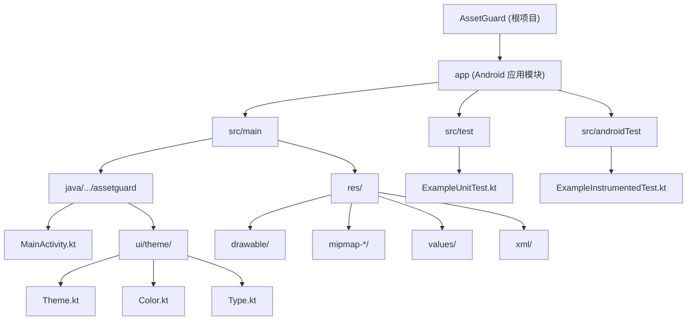

# AssetGuard - 项目文档

## 项目愿景

AssetGuard 是一款 Android 资产管理/守护应用，基于 Kotlin 和 Jetpack Compose 构建，采用 Material3 设计语言。项目目标是为用户提供安全、直观的个人资产管理工具，涵盖债务管理、开支追踪等功能（目前处于初始搭建阶段）。

---

## 架构总览

| 维度 | 说明 |
|------|------|
| **平台** | Android（minSdk 24 / targetSdk 36） |
| **语言** | Kotlin 2.0.21 |
| **UI 框架** | Jetpack Compose + Material3（动态配色） |
| **构建系统** | Gradle 8.13 + Kotlin DSL + Version Catalog |
| **AGP 版本** | 8.13.2 |
| **Compose BOM** | 2024.09.00 |
| **Java 兼容** | Java 11（source + target） |
| **项目结构** | 单模块（`:app`） |
| **架构模式** | 单 Activity + Compose（当前为脚手架阶段，推荐演进为 MVVM / Clean Architecture） |

---

## 模块结构图



---

## 模块索引

| 模块 | 路径 | 语言 | 职责 | 状态 | 文档 |
|------|------|------|------|------|------|
| app | `app/` | Kotlin | Android 主应用模块，包含 UI、业务逻辑、资源 | 初始搭建阶段（约 5%） | [app/CLAUDE.md](./app/CLAUDE.md) |

---

## 运行与开发

### 环境要求

- Android Studio（推荐最新稳定版，需支持 AGP 8.13+）
- JDK 11+
- Android SDK，compileSdk 36

### 构建命令

```bash
# 构建 Debug APK
./gradlew assembleDebug

# 构建 Release APK
./gradlew assembleRelease

# 清理构建产物
./gradlew clean
```

### 运行测试

```bash
# 单元测试
./gradlew test

# Android Instrumented 测试（需连接设备或模拟器）
./gradlew connectedAndroidTest
```

### 关键配置文件

| 文件 | 用途 |
|------|------|
| `settings.gradle.kts` | 项目设置，声明包含的模块（`:app`） |
| `build.gradle.kts`（根） | 顶层插件声明 |
| `app/build.gradle.kts` | 应用模块构建配置、依赖 |
| `gradle/libs.versions.toml` | 统一版本目录（Version Catalog） |
| `gradle.properties` | Gradle 全局属性（JVM 参数、AndroidX 等） |
| `gradle/wrapper/gradle-wrapper.properties` | Gradle Wrapper 版本（8.13） |

---

## 测试策略

| 类型 | 框架 | 位置 | 当前状态 |
|------|------|------|----------|
| 单元测试 | JUnit 4 | `app/src/test/` | 仅占位示例 |
| Instrumented 测试 | AndroidX Test + Espresso | `app/src/androidTest/` | 仅占位示例 |
| Compose UI 测试 | Compose UI Test JUnit4 | （尚未编写） | 依赖已声明但未使用 |

**建议**：随着业务代码增长，应建立以下测试层次：
1. ViewModel / UseCase 单元测试
2. Repository 集成测试
3. Compose UI 组件测试
4. 端到端 Instrumented 测试

---

## 编码规范

- **Kotlin 代码风格**：遵循 Kotlin 官方编码规范（`kotlin.code.style=official`）
- **Compose 最佳实践**：
  - 使用 `Modifier` 参数作为 Composable 函数的第一个可选参数
  - 保持 Composable 函数无副作用
  - 使用 `@Preview` 注解预览 UI 组件
- **包结构**：按功能组织（package-by-feature）
  ```
  com.zipper.compose.assetguard/
  ├── data/          # 数据层（仓库、数据库）
  ├── domain/        # 领域模型、用例
  ├── ui/            # UI 层（屏幕、组件、ViewModel）
  └── di/            # 依赖注入
  ```
- **构建配置**：使用 Kotlin DSL（`.gradle.kts`）+ Version Catalog（`libs.versions.toml`）
- **ProGuard**：Release 构建当前未启用混淆（`isMinifyEnabled = false`）

---

## AI 使用指引

- 本项目为 Android Jetpack Compose 应用，修改代码时请使用 Kotlin 语言
- UI 层应使用 Compose 声明式写法，不使用传统 View 系统
- 主题系统位于 `app/src/main/java/com/zipper/compose/assetguard/ui/theme/`，新增颜色/排版应在此处扩展
- 项目使用 Version Catalog 管理依赖，新增依赖请同时更新 `gradle/libs.versions.toml` 和对应的 `build.gradle.kts`
- 项目当前处于初始阶段，大部分业务功能尚未实现，可大胆提出架构建议
- `.claude/skills/` 目录下包含 Android 移动设计相关的 Skill 参考文档

---

## 变更记录 (Changelog)

| 时间 | 操作 | 说明 |
|------|------|------|
| 2026-02-11 15:04:21 | 初始生成 | 首次扫描项目并生成根级 CLAUDE.md、更新 app/CLAUDE.md、创建 .claude/index.json |
