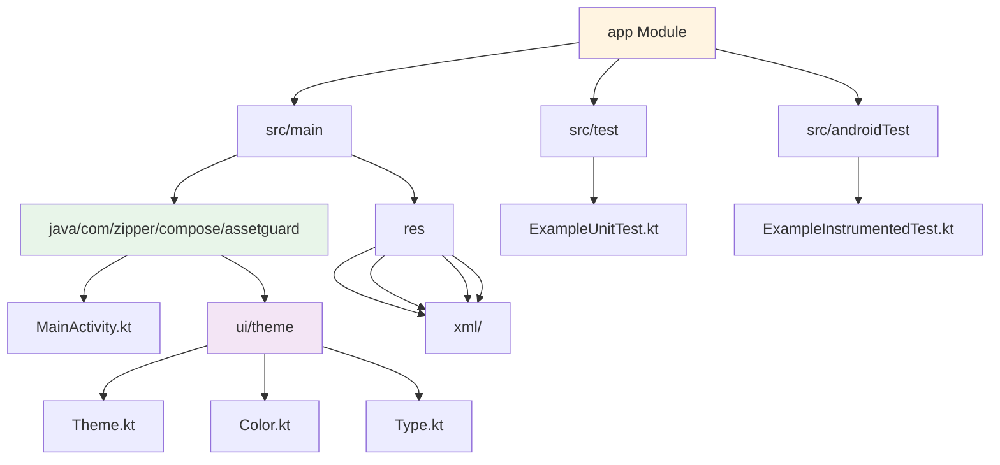

# App Module Documentation

**Navigation**: Root > app

---

## Module Overview

The `app` module is the main application module for AssetGuard. It contains the complete Android application including UI components, business logic, resources, and configurations.

**Module Type**: Android Application
**Package Name**: `com.zipper.compose.assetguard`
**Build Configuration**: `app/build.gradle.kts`

---

## Module Structure



---

## Entry Points

### MainActivity
- **File**: `src/main/java/com/zipper/compose/assetguard/MainActivity.kt`
- **Type**: Single Activity architecture
- **Description**: The app's single entry point that hosts all Compose UI
- **Status**: Basic implementation with greeting screen (placeholder)

```kotlin
class MainActivity : ComponentActivity() {
    override fun onCreate(savedInstanceState: Bundle?) {
        super.onCreate(savedInstanceState)
        enableEdgeToEdge()
        setContent {
            AssetGuardTheme {
                // UI content
            }
        }
    }
}
```

### AndroidManifest
- **File**: `src/main/AndroidManifest.xml`
- **Launch Activity**: MainActivity
- **Application Label**: @string/app_name
- **Theme**: Theme.AssetGuard (Material3)
- **Backup Rules**: Configured for Android backup system

---

## Dependencies & Build Configuration

### Build Script
- **File**: `app/build.gradle.kts`
- **Plugins**:
  - `com.android.application`
  - `org.jetbrains.kotlin.android`
  - `org.jetbrains.kotlin.plugin.compose`

### Compile Options
- **Compile SDK**: 36
- **Min SDK**: 24 (Android 7.0)
- **Target SDK**: 36 (Android 15)
- **Java Version**: 11
- **JVM Target**: 11

### Key Dependencies
```kotlin
// Core Android
implementation(libs.androidx.core.ktx)              // 1.17.0
implementation(libs.androidx.lifecycle.runtime.ktx) // 2.10.0
implementation(libs.androidx.activity.compose)      // 1.12.2

// Jetpack Compose
implementation(platform(libs.androidx.compose.bom)) // 2024.09.00
implementation(libs.androidx.compose.ui)
implementation(libs.androidx.compose.ui.graphics)
implementation(libs.androidx.compose.ui.tooling.preview)
implementation(libs.androidx.compose.material3)

// Testing
testImplementation(libs.junit)                      // 4.13.2
androidTestImplementation(libs.androidx.junit)      // 1.3.0
androidTestImplementation(libs.androidx.espresso.core) // 3.7.0
```

### Build Features
- **Compose**: Enabled
- **BuildConfig**: Default
- **View Binding**: Not used (Compose-only)

---

## UI Architecture

### Theme System
**Location**: `src/main/java/com/zipper/compose/assetguard/ui/theme/`

#### Theme.kt
- **Purpose**: Material3 theme configuration
- **Features**:
  - Dynamic color support (Android 12+)
  - Light/Dark theme switching
  - Material3 theming

```kotlin
@Composable
fun AssetGuardTheme(
    darkTheme: Boolean = isSystemInDarkTheme(),
    dynamicColor: Boolean = true,
    content: @Composable () -> Unit
)
```

#### Color.kt
- **Purpose**: Color scheme definitions
- **Schemes**:
  - Light Color Scheme (Purple40 primary)
  - Dark Color Scheme (Purple80 primary)
  - Custom color palettes

#### Type.kt
- **Purpose**: Typography configuration
- **Content**: Material3 typography presets

---

## Resources

### Resource Directories
```
app/src/main/res/
├── drawable/           # Custom drawables
├── mipmap-anydpi-v26/  # Adaptive icons (Android 8.0+)
├── mipmap-hdpi/        # High DPI icons (72x72 dp)
├── mipmap-mdpi/        # Medium DPI icons (48x48 dp)
├── mipmap-xhdpi/       # Extra-high DPI icons (96x96 dp)
├── mipmap-xxhdpi/      # Extra-extra-high DPI icons (144x144 dp)
├── mipmap-xxxhdpi/     # Extra-extra-extra-high DPI icons (192x192 dp)
├── values/             # String values, dimensions, styles
└── xml/                # XML configurations (backup rules, data extraction)
```

---

## Test Structure

### Unit Tests
- **Location**: `src/test/java/com/zipper/compose/assetguard/`
- **Test File**: `ExampleUnitTest.kt`
- **Framework**: JUnit 4
- **Coverage**: Placeholder test (addition_isCorrect)

### Instrumented Tests
- **Location**: `src/androidTest/java/com/zipper/compose/assetguard/`
- **Test File**: `ExampleInstrumentedTest.kt`
- **Framework**: AndroidX Test Runner + JUnit
- **Coverage**: Package name verification test
- **Test Runner**: `androidx.test.runner.AndroidJUnitRunner`

---

## Key Files & Their Purposes

### Core Application Files
| File | Purpose | Status |
|------|---------|--------|
| `MainActivity.kt` | Single entry point, hosts Compose UI | Placeholder |
| `AndroidManifest.xml` | App configuration, permissions, components | Configured |
| `build.gradle.kts` | Module dependencies and build config | Complete |

### UI Theme Files
| File | Purpose | Status |
|------|---------|--------|
| `ui/theme/Theme.kt` | Material3 theme wrapper | Complete |
| `ui/theme/Color.kt` | Color scheme definitions | Complete |
| `ui/theme/Type.kt` | Typography system | Complete |

### Test Files
| File | Purpose | Status |
|------|---------|--------|
| `ExampleUnitTest.kt` | Unit test example | Placeholder |
| `ExampleInstrumentedTest.kt` | Instrumented test example | Placeholder |

---

## Implementation Status

### Completed
- ✅ Basic project structure
- ✅ Material3 theme system with dynamic color
- ✅ Single activity architecture setup
- ✅ Edge-to-edge display support
- ✅ Build configuration with Kotlin DSL
- ✅ Version catalog integration

### Pending Implementation
- ⏳ Navigation structure (Jetpack Navigation Compose)
- ⏳ Screen implementations (debt management, expenses, etc.)
- ⏳ Data layer setup (Room Database)
- ⏳ Dependency injection configuration
- ⏳ ViewModels and state management
- ⏳ Repository pattern implementation
- ⏳ Business logic layer
- ⏳ Real UI components (currently only placeholder)
- ⏳ Biometric authentication
- ⏳ Data backup/restore functionality

---

## Architecture Notes

### Current Architecture
- **UI Layer**: Jetpack Compose (basic setup only)
- **Business Logic**: Not yet implemented
- **Data Layer**: Not yet implemented

### Recommended Architecture (Future)
```
┌─────────────────────────────────────┐
│      UI Layer (Compose)             │
│  - Screens                          │
│  - Components                       │
│  - ViewModels                       │
└─────────────────────────────────────┘
              ↓
┌─────────────────────────────────────┐
│      Domain Layer                   │
│  - Use Cases                        │
│  - Domain Models                    │
│  - Repository Interfaces            │
└─────────────────────────────────────┘
              ↓
┌─────────────────────────────────────┐
│      Data Layer                     │
│  - Room Database                    │
│  - Repository Implementations       │
│  - Data Sources (Local/Backup)      │
└─────────────────────────────────────┘
```

---

## Development Guidelines

### Adding New Features
1. Create Compose screens in appropriate packages
2. Implement ViewModels for state management
3. Use Navigation Compose for screen navigation
4. Follow Material3 design guidelines
5. Ensure dark mode compatibility

### Testing Guidelines
- Write unit tests for business logic
- Write instrumented tests for UI components
- Use Compose Testing library for UI tests
- Mock dependencies for isolated testing

### Code Organization
- Follow package-by-feature structure:
  ```
  com.zipper.compose.assetguard/
  ├── data/          # Data layer (repositories, database)
  ├── domain/        # Domain models, use cases
  ├── ui/            # UI layer (screens, components, viewmodels)
  └── di/            # Dependency injection (if using Hilt)
  ```

---

## Common Tasks

### Building the App
```bash
./gradlew assembleDebug
```

### Running Tests
```bash
# Unit tests
./gradlew test

# Instrumented tests
./gradlew connectedAndroidTest
```

### Code Style
- Use Kotlin coding conventions
- Follow Compose best practices
- Enable Compose compiler metrics (optional for optimization)

---

## Module Statistics

- **Total Kotlin Files**: 6
- **Package Structure**: `com.zipper.compose.assetguard`
- **UI Framework**: Jetpack Compose with Material3
- **Test Coverage**: Minimal (placeholder tests only)
- **Implementation Progress**: ~5% (initial setup phase)

---

**Navigation**: Root > app
**Last Updated**: 2026-02-01
**Status**: Initial Development Phase
